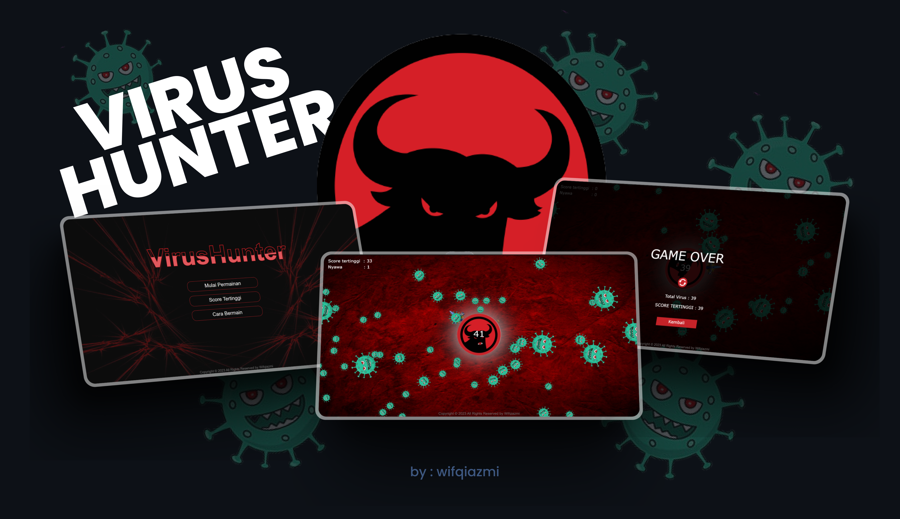

   
   

  <h2 align="center">Virus Hunter Game</h2>

Virus Shooter Game adalah permainan sederhana berbasis web yang menguji ketangkasan dan reaksi pemain dalam menghancurkan 
virus yang mendekat ke planet.

   Game ini di buat dengan HTML, CSS, VANILA, dan JavaScript 

 

### Demo Screeshots

## Cara Bermain

1. Saat halaman dimuat, klik tombol "Mulai" untuk memulai permainan.
2. Anda akan melihat lingkaran planet yang dapat Anda atur dengan menggerakkan kursor.
3. Klik dalam lingkaran permainan untuk menembak virus. Peluru akan diarahkan ke posisi kursor.
4. Peluru akan menghancurkan virus jika bertabrakan. Virus yang berhasil mencapai tengah planet akan mengurangi nyawa.
5. Permainan berakhir jika nyawa habis.
6. Setelah permainan berakhir, Anda dapat melihat skor akhir dan skor tertinggi yang telah Anda capai.
7. Klik tombol "Kembali" untuk memulai permainan kembali.

## Fitur Utama

- Kendalikan lingkaran planet dengan menggerakkan kursor.
- Tembak virus dengan mengklik dalam lingkaran permainan.
- Virus yang berhasil dihancurkan akan meningkatkan skor Anda.
- Hindari virus mencapai tengah planet untuk menjaga nyawa.
- Permainan berakhir jika nyawa habis.
- Lihat skor akhir dan rekam skor tertinggi.
- Mulai ulang permainan dengan mudah.

## Persyaratan

Untuk bermain permainan ini, Anda hanya perlu perangkat dengan browser web yang dapat menjalankan JavaScript.
seperti google chrome

## Cara Menjalankan

1. Buka file `index.html` di browser web Anda.
2. Klik tombol "Mulai" untuk memulai permainan.

## Kontribusi

Jika Anda ingin berkontribusi pada permainan ini, Anda dapat melakukan fork repositori ini, membuat perubahan, dan mengirimkan pull request.
